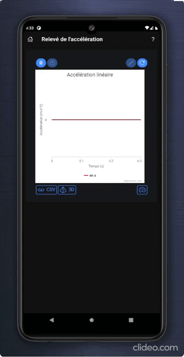
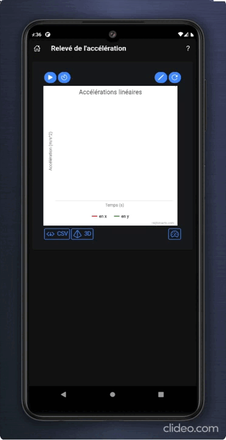
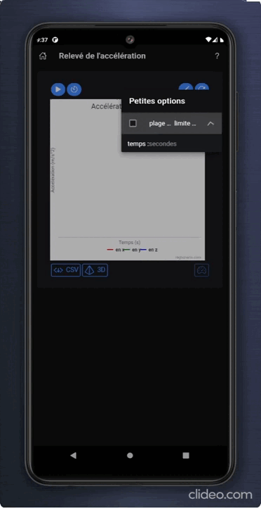
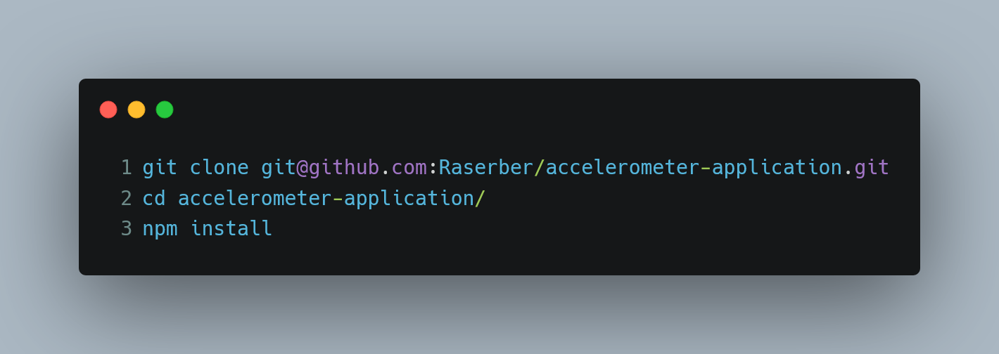
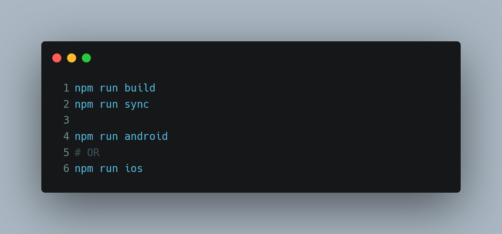

<div align="center">
  
</div>

<h1 align="center">
  
</h1>


---

## Contents

- [Key Features](#key-features)
- [How to Install](#How-to-Install)
- [How to Contribute](#how-to-contribute)

---

> A mobile application to experiment motion.

| linear x + indef time | linear x & y + def time | linear x, y & z + rolling time
| ----------------------------- | ------------------------------ | -------------------------------
|  |  | 

---

## Key Features

- 📉 View a graph of one to three linear or angular accelerations as a function of time made
  with [Highcharts](https://www.highcharts.com/)
- 🕙 Acquire for an indefinite, definite or rolling period of time
- 💾 Export the result to a file in :
    - PNG format [IN DEVELOPMENT]
    - CSV format
- 🎲 3D models to help you navigate in spatial directions in reference to your device made
  with [Spline](https://spline.design/)


- [IN DEVELOPMENT]
    - Translate into English, *currently the application is mostly in French*
    - organize and comment the code, optimize some parts
    - be able to acquire the speed and the relative position of the device *(tests in progress
      with [Kalman filters like](https://en.wikipedia.org/wiki/Kalman_filter)
      and [Inertial measurement unit like](https://en.wikipedia.org/wiki/Inertial_measurement_unit))*

---

## How To Install

### Option 1: Binary

Accelerometer Application is currently available on Android and will be available on IOS a little later.

You can download the latest binary from the [Release page](https://github.com/Raserber/accelerometer-application/releases)

### Option 2: From Source

Reminder of the [npm](https://www.npmjs.com/) and [node](https://nodejs.org/en/) versions know to work :




after, build the application :



Last command will open [Android Studio](https://developer.android.com/studio) *(for Android)*
or [Xcode](https://developer.apple.com/xcode/) *(for Ios)* then follow the Ionic guides :

- [Android](https://ionicframework.com/docs/developing/android)
- [Ios](https://ionicframework.com/docs/developing/ios)

## How to Contribute

Contributions welcome!

first, clone the repository and install dependencies :

```shell
git clone git@github.com:Raserber/accelerometer-application.git
cd accelerometer-application/
npm install
```

To run application in browser as http://localhost:8080/ (usually) like any project brings [Vue](https://vuejs.org/) :

```shell
npm run serve
``` 

then, enjoy !

## Acknowledgements

- Icon :
    - [Velocity vector](https://www.freepik.com/vectors/velocity) created by freepik from [Freepik](https://www.freepik.com/)
    - [Mobile cartoon vector](https://www.freepik.com/vectors/mobile-cartoon) created by pch.vector
      from [Freepik](https://www.freepik.com/)
