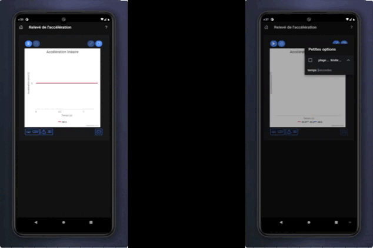

<h1 align="center">
  
  
</h1>

---

## Contents

- [Key Features](#key-features)
- [How to Install](#How-to-Install)
- [How to Use](#How-to-Use)
- [How to Contribute](#how-to-contribute)

---

> A mobile application to experiment motion.

  

---

## Key Features

- 📉 View a graph of one to three linear or angular accelerations as a function of time made
  with [Highcharts](https://www.highcharts.com/)
- 🕙 Acquire for an indefinite, definite or rolling period of time
- 💾 Export the result to a file in :
    - PNG format [IN DEVELOPMENT]
    - CSV format
- 🎲 3D models to help you navigate in spatial directions in reference to your device made
  with [Spline](https://spline.design/)

- [IN DEVELOPMENT]
  - Translate into English, *currently the application is mostly in French*
  - organize and comment the code, optimize some parts
  - be able to acquire the speed and the relative position of the device *(tests in progress with [Kalman filters like](https://en.wikipedia.org/wiki/Kalman_filter)
    and [Inertial measurement unit like](https://en.wikipedia.org/wiki/Inertial_measurement_unit))*

---

## How To Install

[...]

## How to Use

## How to Contribute

Contributions welcome! Please reach first.

## Acknowledgements

- Icon :
  - [Velocity vector](https://www.freepik.com/vectors/velocity) created by freepik from [Freepik](https://www.freepik.com/)
  - [Mobile cartoon vector](https://www.freepik.com/vectors/mobile-cartoon) created by pch.vector from [Freepik](https://www.freepik.com/)
